# ai-color-workflow

An end-to-end AI color grading prototype. Takes ungraded images, predicts graded versions using a small convolutional neural network, and provides a Dash app for visual inspection of the pipeline at every stage.

Built as a learning exercise to validate the architecture of a studio-grade AI color tool. Uses synthetic ungraded/graded pairs derived from sunset photographs to demonstrate the full data → model → training → inference → review loop.

---

## What's in the project

```
ai-color-workflow/
├── data/
│   ├── raw/         # source images (curated sunsets)
│   ├── graded/      # generated graded targets
│   ├── ungraded/    # generated synthetic ungraded inputs
│   ├── predicted/   # model output after inference
│   └── holdout/     # images held out from training for testing
├── docs/screenshots/
├── models/          # trained weights and loss plot (gitignored)
├── scripts/         # CLI entry points
│   ├── generate_pairs.py
│   ├── train.py
│   ├── predict.py
│   └── view_pairs.py
├── src/             # core classes
│   ├── transforms.py    # GainTransform — channel gain math
│   ├── dataset.py       # PairDataset, PairImageDataset
│   ├── generator.py     # PairGenerator — orchestrates pair creation
│   ├── model.py         # ColorGradeNet — CNN architecture
│   ├── trainer.py       # Trainer — training loop with timing & loss plot
│   ├── predictor.py     # Predictor — inference, single & batch
│   └── viewer.py        # PairViewer — Dash inspection app
└── tests/           # pytest suite
```

---

## Setup

```
uv sync
```

That installs all dependencies into a project-local virtual environment.

---

## Step 1 — Inspect the starting state

The repo ships with 11 sunset photographs in `data/raw/`. The other directories are empty until the pipeline runs.

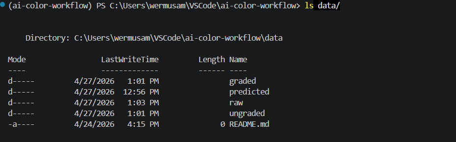

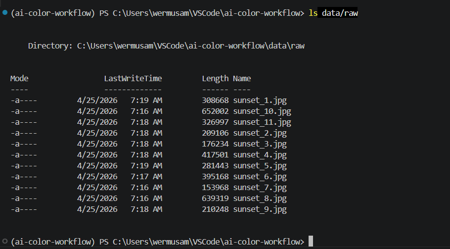

---

## Step 2 — Generate training pairs

```
uv run python -m scripts.generate_pairs
```

Reads each raw image, copies it as the graded target, and applies an inverse channel gain to produce a synthetic ungraded counterpart.

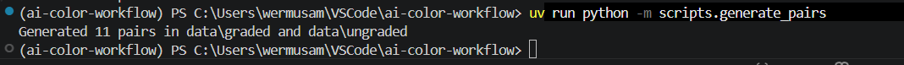

After this step, `data/graded/` and `data/ungraded/` are populated with 11 pairs each, sharing filenames.

---

## Step 3 — Inspect the data before training

```
uv run python -m scripts.view_pairs
```

Launches the Dash app at `http://127.0.0.1:8050/`. Four panels are configured: Raw, Graded, Ungraded, and Prediction. Predictions don't exist yet, so the fourth panel shows a placeholder. The viewer never crashes on missing files — useful for the workflow split between data prep and inference.

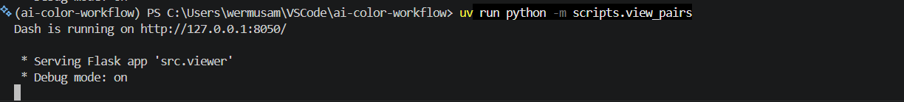

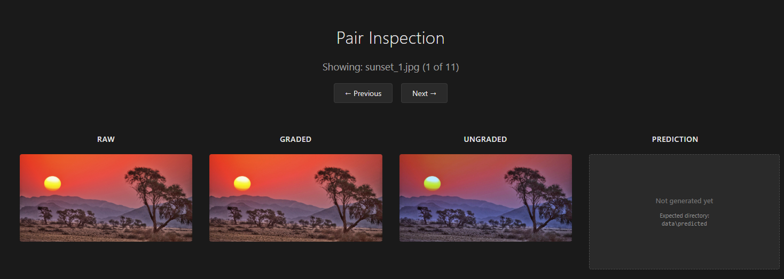

Click through all 11 pairs with the navigation buttons to QA the data before committing to training.

---

## Step 4 — Train the model

```
uv run python -m scripts.train
```

Trains a small CNN (`ColorGradeNet` — three convolutional layers, ~3,200 parameters) at 512×512 resolution for 100 epochs, batch size 4, Adam optimizer at 1e-3. Prints per-epoch timing every 10 epochs and total wall-clock time. Trains in roughly 5 minutes on CPU.

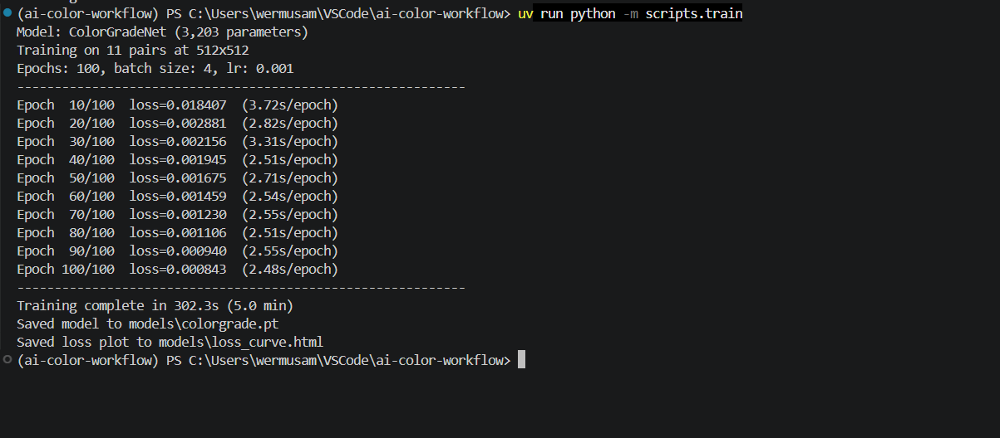

The trainer also writes an interactive loss curve to `models/loss_curve.html`.

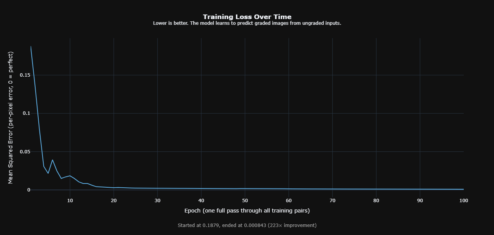

The exponential decay is the expected signature of a healthy training run on a learnable target.

---

## Step 5 — Run inference on the training set

```
uv run python -m scripts.predict
```

Loads the trained weights and predicts a graded version for every ungraded input, writing results to `data/predicted/`.

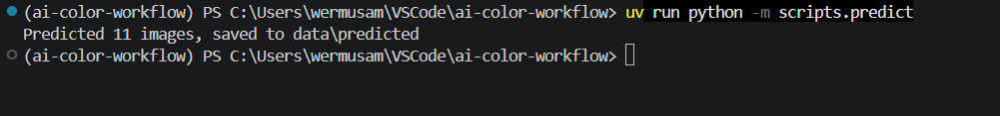

---

## Step 6 — Review the model's output

```
uv run python -m scripts.view_pairs
```

Same viewer command, but the Prediction panel is now populated. Click through each pair and visually compare the model's output against the true graded target.

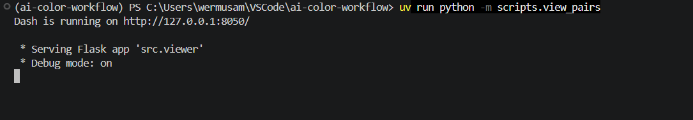

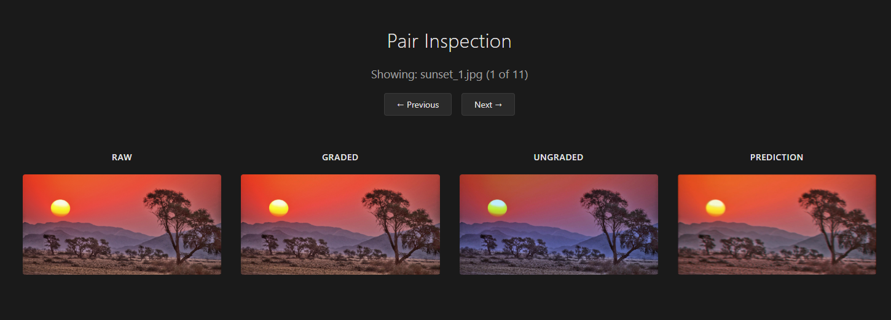

---

## Step 7 — Held-out test

A sunset image the model never saw during training, processed via the same `predict` script:

```
uv run python -m scripts.predict --input data/holdout/sunset_test.jpg --output data/holdout/sunset_test_predicted.jpg
```

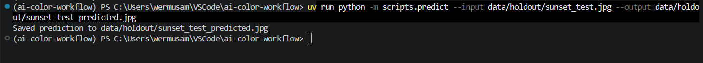

| Input (held-out) | Model prediction |
|---|---|
| 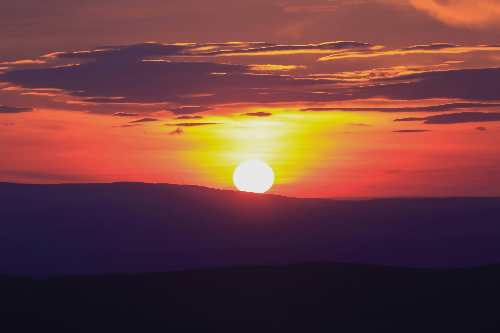 |  |

The held-out test reveals an honest limitation: the model was trained only on warm sunset photographs, so it pushes inputs toward that distribution. This is the expected behavior of a model trained on biased data, and is one of the reasons production training would draw from diverse footage covering many color profiles.

---

## Tests

```
uv run pytest -v
```

14 tests covering the core classes — transforms, dataset, generator, model, trainer, predictor, and viewer.

---

## Architecture summary

| Class | Responsibility |
|---|---|
| `GainTransform` | Per-channel multiplicative gain and its inverse |
| `PairDataset` | Generates ungraded/graded pairs on disk from raw images |
| `PairImageDataset` | PyTorch `Dataset` that yields image tensors during training |
| `PairGenerator` | High-level orchestrator for pair generation |
| `ColorGradeNet` | Small CNN: 3 conv layers, ReLU activations, RGB→RGB |
| `Trainer` | Training loop with timing, loss tracking, Plotly loss curve |
| `Predictor` | Inference for a single image or an entire directory |
| `PairViewer` | Dash app for side-by-side panel inspection |

---

## Honest limitations and next steps

This prototype validates the end-to-end pipeline architecture. It is not a finished product, and the data setup is intentionally simple. Real production work would extend it in several directions:

- **Real footage instead of synthetic pairs.** The current setup invertibly transforms graded targets to fake ungraded inputs, so the model is learning to invert a deterministic operation. Real ungraded plates and colorist passes would test the architecture against a much harder learning problem.
- **CDL or LUT prediction.** Production color tools typically predict reusable color recipes (Color Decision Lists, 3D LUTs) rather than pixel-to-pixel mappings. This makes outputs editable, shareable, and resolution-independent.
- **Larger model.** A U-Net or similar architecture would capture more spatial context and produce sharper outputs at native resolution.
- **Diverse training data.** As the held-out test shows, the model's outputs are biased toward its training distribution. Studio data covering multiple genres and looks would generalize much better.
- **Evaluation metrics beyond MSE.** PSNR, SSIM, and perceptual losses (LPIPS) are standard for image-to-image regression and would give a more honest picture of perceptual quality.
- **Nuke integration.** Either via CopyCat for in-Nuke training, or a deep ops node for inference inside the comp pipeline.
- **Live training dashboard.** Watch loss, sample predictions, and gradient health update in real time during training.

---

## Stack

Python 3.13, PyTorch, torchvision, Dash, Plotly, Pillow, NumPy. Managed with `uv`. Linted with `ruff`. Tested with `pytest`.